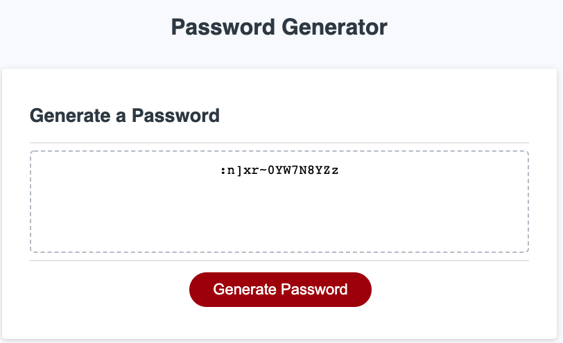

# Password Generator


## Overview
This JS code prompts the user to:
- Enter the length of their desired password (between 8 and 128)
- Select whether they want to include:
		
		Lowercase letters
		Uppercase letter
		Numbers
		Special Characters

- The users have to select at least one character type in order for the password to be generated
- The password is then displayed on the page using the textarea's DOM

## :point_right: Randomizing function calls  
The code uses Math.random() method to randomize function calls. The functions are included in an array.
 
`var myFunctions = ['generateValue("LCASECHAR")', 'generateValue("UCASECHAR")', 'generateValue("NUMBER")', 'generateValue("SPECIALCHARS")'];`

In the snippet below, function calls are randomized

`tempValue = eval(myFunctions[Math.floor(Math.random() * myFunctions.length)]);`

## :point_right: Conforming to user selections
The password will only be generated based on what the user has decided to include. 
In the snippet below, code will ensure the above

```
function setRemainingPasswordChars(length) {
  var value = '';

  //check if the value confirms to the user's input
  //if not, then keep retrying

  tempValue = eval(myFunctions[Math.floor(Math.random() * myFunctions.length)]);

  if ((passwordProps["hasUpperCaseChar"] === "NO") && (characters.includes(tempValue))){
    i--;
  }
  else if ((passwordProps["hasLowerCaseChar"] === "NO") && (characters.toLowerCase().includes(tempValue))){
    i--;
  }
  else if ((passwordProps["hasNumericValues"] === "NO") && (numbers.toLowerCase().includes(tempValue))){
    i--;
  }
  else if ((passwordProps["hasSpecialChars"] === "NO") && (specialChars.indexOf(tempValue)>-1)){
    i--;
  }		
  else {
    value += tempValue;
  }
  return value;
}
```

## :point_right:  Github link to the deployed application: [https://ravnishgupta.github.io/password-generator/](url)


